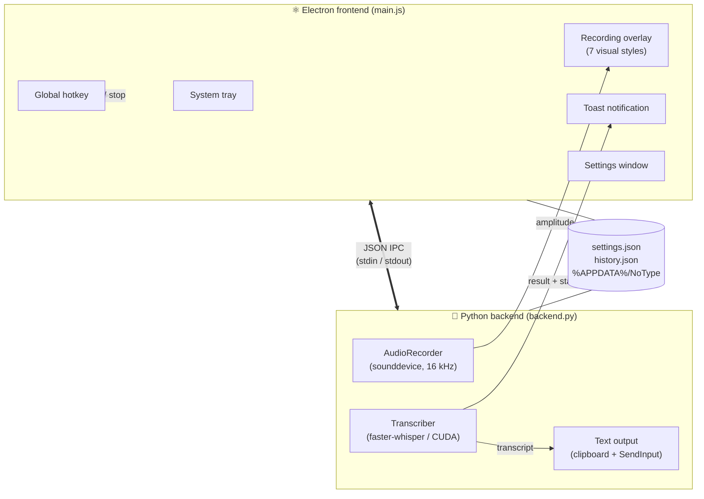

<div align="center">


# NoType

### Local, privacy‑first voice dictation for Windows 11

**Hold a key. Speak. Release. Your words appear — anywhere you can type.**

No cloud. No account. No data leaves your machine. Powered by [faster‑whisper](https://github.com/SYSTRAN/faster-whisper) running locally on your GPU.

<br/>


</div>

---

## Table of Contents

- [What it does](#what-it-does)
- [Features](#features)
- [How it works](#how-it-works)
- [Overlay styles](#overlay-styles)
- [Installation](#installation)
- [Build from source](#build-from-source)
- [Configuration](#configuration)
- [Your data & privacy](#your-data--privacy)
- [Reliability engineering](#reliability-engineering)
- [Troubleshooting](#troubleshooting)
- [Project structure](#project-structure)
- [Tech stack](#tech-stack)
- [License](#license)

---

## What it does

NoType turns your voice into text in **any** application — your editor, your browser, your chat window, your terminal. Press and hold your hotkey, speak naturally, and release. A fraction of a second later the transcription is pasted right where your cursor is.

Everything runs **on your own machine**. The speech model is downloaded once and then executes entirely offline on your GPU (with an automatic CPU fallback). Nothing is ever sent to a server.

```
  ┌──────────────┐     hold hotkey      ┌──────────────┐    release     ┌──────────────┐
  │   You speak  │  ───────────────►    │  Live overlay │  ──────────►   │  Text pasted │
  │   into mic   │     (visualizer)     │  reacts to    │  transcribe    │  at cursor   │
  └──────────────┘                      │  your voice   │   locally      └──────────────┘
                                        └──────────────┘
```

---

## Features

- 🎙️ **Push‑to‑talk dictation** — hold‑to‑speak or press‑to‑toggle, your choice.
- 🔒 **100% local & private** — local Whisper inference, no network, no telemetry, no account.
- ⚡ **GPU‑accelerated** — CUDA `float16` / `int8_float16` via faster‑whisper; automatic CPU fallback.
- 🤖 **AI transcript cleanup** — an optional local LLM (via Ollama, installed **in‑app with one click**) removes filler words and polishes grammar. Rule‑based instant cleanup as default; hard latency budget so the LLM never slows you down.
- 🛡️ **Anti‑hallucination** — noise and silence no longer become "sehr sehr sehr": repetitive/low‑confidence segments are dropped at the decoder level.
- 📺 **Live transcript** — watch your words appear in the overlay while you're still speaking (optional).
- 🌍 **Multilingual** — German, English, Polish, Croatian, with optional automatic language detection. Tuned for mixed DE/EN speech.
- 🧠 **Custom vocabulary** — bias the model toward your product names, brands and jargon (up to 850 characters / Whisper's full 224‑token prompt budget).
- 🎚️ **Tunable quality/speed** — pick the model (`tiny` → `large‑v3‑turbo`), beam size, quantization and VAD sensitivity.
- ✨ **Seven animated overlays** — voice‑reactive visualizers from a minimal sine wave to a Siri‑style aurora.
- 📋 **Smart insert** — clipboard + native `SendInput` Ctrl+V with an automatic direct‑typing fallback for terminals and paste‑resistant apps.
- 🗂️ **History & stats** — last 10 transcriptions plus today / 7‑day / 30‑day word counts, right in the tray.
- 🛟 **Self‑healing** — backend auto‑restart with a circuit breaker, IPC watchdog, GPU compute‑type auto‑fallback, startup inference self‑test, atomic settings with rolling backups.
- 🖥️ **Native Windows 11 feel** — Mica/dark‑mode settings window, system‑tray control, single‑instance.

---

## How it works

NoType is a small hybrid app: a **Python backend** does the audio + speech work, an **Electron frontend** owns the UI (tray, overlay, settings, toast) and the global hotkey. They talk over newline‑delimited JSON on stdin/stdout.



**The recording loop:**

1. You press the hotkey → Electron shows the overlay and tells the backend to start recording.
2. `sounddevice` captures 16 kHz mono audio; per‑block RMS amplitude streams to the overlay so the visualizer reacts to your voice. With live preview enabled, a rolling low‑latency Whisper pass paints the recognized text into the overlay while you speak.
3. You release → the backend runs the full‑quality faster‑whisper pass (VAD filtering + anti‑hallucination thresholds) on the captured audio.
4. The transcript is cleaned up — instant rule‑based filler removal, optionally polished by a local LLM (Ollama) within a strict latency budget.
5. The text is inserted at your cursor: clipboard + simulated Ctrl+V via the Windows `SendInput` API, with an automatic direct‑typing fallback.
6. The tray history and stats update (an optional toast can confirm each dictation).

---

## Overlay styles

Pick your recording visualizer in **Settings → Overlay‑Stil**. Every style reacts to your microphone amplitude in real time, runs at a capped, GPU‑safe frame rate, and supports light/dark.

| Style | Look | Inspiration |
|---|---|---|
| **Wave** *(default)* | Three layered, glowing sine waves | Apple Siri waveform |
| **Wave Classic** | Single minimal ethereal sine line | The original NoType look |
| **Aurora** | Rotating multi‑color conic‑gradient orb with a breathing core | Siri "Hey Siri" vortex |
| **Particles** | A flowing stream of glowing particles that fade in/out at the edges | Linear loading states |
| **Pulse** | A breathing mint orb with soft concentric ripples | ChatGPT voice mode |
| **Ribbon** | Slow, silky multi‑strand ribbons | Material 3 / Tally |
| **Spectrum** | Gradient FFT bars on a dark glass card | Spotify now‑playing |

---

## Installation

> **Requirements:** Windows 11 (x64). An NVIDIA GPU with CUDA is recommended for real‑time speed; the app falls back to CPU automatically if none is available. The chosen Whisper model is downloaded once on first run.

### From the installer (recommended)

1. Grab `NoType-Setup-<version>.exe` from the build output (`dist/`) or a release.
2. Run it and keep the default install location (`%LOCALAPPDATA%\Programs\NoType`) — no admin rights required.
3. Launch NoType. The first run downloads the speech model; after that it works fully offline.
4. The app lives in your system tray. Hold your hotkey (default **Ctrl + Shift + Space**, customizable) and start dictating.

---

## Build from source

### Prerequisites

- **Python 3.12** with a virtual environment
- **Node.js 18+** and npm
- *(optional)* an NVIDIA GPU + CUDA runtime for GPU inference

### 1. Python backend

```bash
# from the project root
python -m venv venv
venv\Scripts\activate
pip install -r requirements.txt

# freeze the backend into dist/backend/backend.exe
pyinstaller --noconfirm --clean backend.spec
```

### 2. Electron frontend

```bash
cd electron
npm install

# run in dev mode (uses the venv Python directly)
npm start

# or build the installer (bundles dist/backend) → dist/NoType-Setup-<version>.exe
npm run build
```

> The PyInstaller build uses `--onedir` + `console=False` (the backend recovers its stdio pipes for IPC, so no console window ever appears). electron‑builder packages the frozen backend as an extra resource and produces an NSIS installer.

### Regenerating icons

```bash
python tools/make_icon.py   # writes electron/assets/icon.ico, icon.png, tray-*.png
```

---

## Configuration

All settings live in the **Settings** window (system tray → ⚙) and are stored in `settings.json`.

| Setting | Options | Default | Notes |
|---|---|---|---|
| **Hotkey** | any combination | `Ctrl + Shift + Space` | Recorded live in the UI |
| **Mode** | hold‑to‑speak · press‑to‑speak | hold‑to‑speak | Hold while talking, or toggle on/off |
| **Language** | `de` · `en` · `pl` · `hr` | `de` | Plus automatic detection |
| **Auto language detection** | on / off | on | Detects the spoken language per recording |
| **Model** | `tiny` · `base` · `small` · `medium` · `large-v3` · `large-v3-turbo` | `small` | Bigger = more accurate, slower |
| **Beam size** | auto · 1 · 3 · 5 | auto | Auto scales with clip length |
| **Quantization** | `float16` · `int8_float16` · `int8` | `float16` | `int8_float16` is fastest on Turing+ GPUs |
| **VAD sensitivity** | 100–500 ms | 300 ms | Silence filtering aggressiveness |
| **Microphone** | system default or a specific device | system | |
| **Custom vocabulary** | free text (*initial prompt*), up to 850 chars | — | e.g. brand/product names so Whisper spells them right |
| **Text cleanup** | off · fast (rules) · AI (local LLM) | fast | AI mode uses Ollama (one‑click in‑app install) and falls back to rules when unavailable or over budget |
| **Live transcript** | on / off | on | Rolling recognized text in the overlay while recording |
| **Insert method** | auto (Ctrl+V + typing fallback) · always type | auto | "Always type" for terminals/apps that ignore Ctrl+V |
| **Success popup** | on / off | off | Errors and warnings always show |
| **Overlay style** | 7 styles | Wave | See [Overlay styles](#overlay-styles) |
| **Dark mode overlay** | on / off | off | |
| **GPU safe mode** | on / off | off | Disables hardware acceleration — see [Troubleshooting](#troubleshooting) |

---

## Your data & privacy

NoType is built to keep everything on your machine. There is **no network call** for transcription and **no telemetry**.

All persistent state lives in `%APPDATA%\NoType\`:

| File | Contents |
|---|---|
| `settings.json` | Your configuration (plus 3 rolling `.bak` backups) |
| `history.json` | Last 10 transcriptions + per‑day word/usage stats |
| `notype.log` | Rotating diagnostic log (5 MB × 3) |

Network access is limited to **one‑time downloads**: the Whisper model from Hugging Face on first use, and — only if you enable AI cleanup — the portable Ollama runtime and its LLM (stored under `%APPDATA%\NoType\ollama\`, removed with the app). Dictation itself, including the AI cleanup, works completely offline.

---

## Reliability engineering

NoType is hardened against the failure modes of a long‑running, GPU‑heavy desktop app:

- **Serialized inference** — a global lock ensures only one Whisper pass touches the (non‑thread‑safe) CUDA model at a time.
- **Backend circuit breaker** — if the native backend dies, it auto‑restarts with exponential backoff and gives up after repeated fast crashes (rather than hammering a wedged GPU driver forever).
- **IPC watchdog** — a ping/pong heartbeat detects a frozen backend and recycles it.
- **Atomic settings** — `settings.json` is written via temp‑file + rename with three rolling backups and automatic recovery from corruption.
- **Compute‑type auto‑fallback** — GPUs that accept `int8_float16` at load time but reject it at inference time (cuBLAS `NOT_SUPPORTED`) are downgraded to `float16` on the fly; the working setting is persisted. A startup self‑test triggers this before your first dictation ever sees it.
- **Lifetime‑bound Ollama** — the AI‑cleanup runtime is tied to the backend with a kill‑on‑close Job Object, so even a force‑killed app never leaves an orphaned server behind.
- **GPU‑safe overlay** — the visualizer is frame‑rate‑capped and avoids the compositing constructs (live `backdrop-filter`, `mix-blend-mode`, per‑frame `box-shadow`/gradient allocation) that trigger driver TDR on transparent always‑on‑top windows.
- **Single‑instance lock** + resilient tray creation so boot‑time launches never end up headless.

---

## Troubleshooting

<details>
<summary><b>Graphics glitches, screen artifacts, or driver crashes while NoType is active</b></summary>

<br/>

Enable **Settings → System → GPU‑Sicherheitsmodus (GPU safe mode)** and restart the app. This disables hardware acceleration and moves all compositing to the CPU — the definitive escape hatch for flaky GPU drivers. Updating your GPU driver is also recommended, as these crashes are usually a driver/hardware fault that the app can only mitigate.

</details>

<details>
<summary><b>The hotkey doesn't trigger / nothing happens</b></summary>

<br/>

- Make sure the model has finished loading — the tray tooltip shows "Modell lädt…" until it's ready.
- Check that another app isn't already using the same global shortcut.
- Inspect `%APPDATA%\NoType\notype.log` for errors.

</details>

<details>
<summary><b>Transcription is slow</b></summary>

<br/>

Use a smaller model (`small` or `base`), set quantization to `int8_float16` on a Turing‑or‑newer NVIDIA GPU, or keep beam size on **auto**. `large‑v3‑turbo` is the best accuracy/speed balance for a capable GPU.

</details>

<details>
<summary><b>Whisper misspells specific names</b></summary>

<br/>

Add them to **Settings → Custom vocabulary (initial prompt)** — e.g. `Anthropic, MetricDash, Supabase`. Whisper uses this as a bias toward your terms.

</details>

---

## Project structure

```
No Type/
├── backend.py            # Python backend: IPC loop, recording, transcription orchestration
├── audio_recorder.py     # sounddevice capture, RMS amplitude, pause/resume
├── transcriber.py        # faster-whisper wrapper, model cache, inference lock, cuBLAS fallback
├── postprocess.py        # transcript cleanup: rules (fillers, stutter) + local LLM via Ollama
├── ollama_manager.py     # portable Ollama install, serve lifecycle (job object), model pull
├── text_output.py        # clipboard + SendInput Ctrl+V, Unicode typing fallback
├── config.py             # atomic settings load/save with rolling backups (%APPDATA%/NoType)
├── backend.spec          # PyInstaller build (--onedir, console=False)
├── requirements.txt
├── tools/
│   └── make_icon.py      # generates the app + tray icons
└── electron/
    ├── main.js           # Electron main: tray, overlay, hotkey, IPC, lifecycle, GPU safety
    ├── preload.js        # contextBridge IPC surface
    ├── overlay.html      # the 7 voice-reactive recording visualizers
    ├── settings.html     # settings window (Mica + dark mode)
    ├── toast.html        # transcription confirmation toast
    ├── package.json      # electron-builder config (NSIS installer)
    └── assets/           # icons
```

---

## Tech stack

| Layer | Technology |
|---|---|
| Speech‑to‑text | [faster‑whisper](https://github.com/SYSTRAN/faster-whisper) (CTranslate2) on CUDA / CPU |
| AI text cleanup | [Ollama](https://ollama.com/) (portable, in‑app managed) + Qwen 2.5 3B, fully local |
| Audio capture | [sounddevice](https://python-sounddevice.readthedocs.io/) (PortAudio), NumPy |
| Backend packaging | [PyInstaller](https://pyinstaller.org/) (`--onedir`) |
| Desktop shell | [Electron 33](https://www.electronjs.org/) |
| Installer | [electron‑builder](https://www.electron.build/) (NSIS) |
| Text injection | Windows `SendInput` via `ctypes`, [pyperclip](https://github.com/asweigart/pyperclip) |
| IPC | newline‑delimited JSON over stdin/stdout |

---

## License

Released under the **Functional Source License 1.1 (FSL‑1.1‑MIT)**. See [`LICENSE`](LICENSE) for the full text.

In plain words: you can use NoType freely — personally, at work, for education and research — and read, modify and share the code. What you may **not** do is take it and offer it as a **competing commercial product or service**. Each release automatically becomes available under the plain MIT license two years after publication.

<div align="center">
<br/>
<sub>Built for people who think faster than they type. 🎙️</sub>
</div>
