<div align="center">

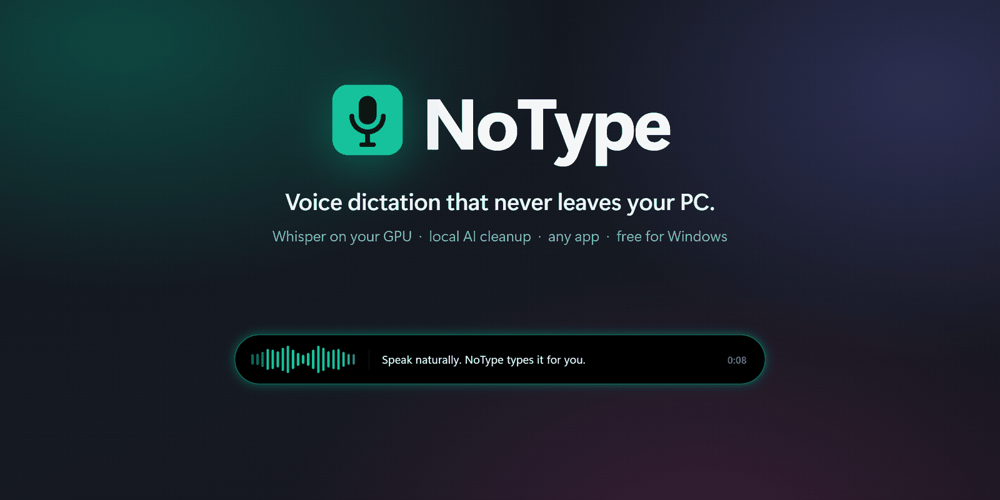

**Hold a key. Say what you're thinking. Let go. Your words appear wherever your cursor is.**

Free voice dictation for Windows 11 that runs entirely on your own PC.<br/>
No cloud, no subscription, no account. Nothing you say ever leaves your computer.

<br/>

[](https://github.com/MJM-DEVS/NoType/releases/latest)
&nbsp;
[](https://mjmads.com)

[](https://github.com/MJM-DEVS/NoType/releases/latest)


[](#license)
[](https://github.com/MJM-DEVS/NoType/stargazers)

<br/>

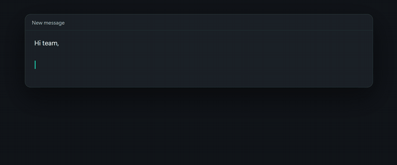

</div>

<br/>

## What is NoType?

Most people speak about three times faster than they type. NoType turns that speed into text in your email, your chat, your documents and your code editor: any app where you can place a cursor.

You hold a shortcut, talk, and let go. A small overlay shows that NoType is listening and what it has understood so far. When you release the key, your words are written into the app you were using, with punctuation and without the "uhms". It usually takes less than a second.

What makes it different from cloud dictation tools:

- 🔒 **Completely private.** Speech recognition and AI cleanup run on your own graphics card. There is no server, no telemetry and no account.
- 💸 **Free, no subscription.** Install it once and use it for as long as you like. The speech models are free and are downloaded once.
- ⚡ **Fast.** On a modern NVIDIA graphics card your text usually appears in well under a second.
- 🌍 **Works in any app and 99 languages,** including German with English terms mixed in (or the other way around).

Screenshots, a live preview of every overlay style and a guide to the speech models are on the **[NoType page at mjmads.com](https://mjmads.com/en/notype/)** (also in [German](https://mjmads.com/de/notype/) and [Polish](https://mjmads.com/pl/notype/)).

<br/>

## Download

| | Best for | How |
|---|---|---|
| 🟢 **Installer** (`NoType-Setup-x.y.z.exe`) | Most people | Run it, click through, done. Creates Start menu and desktop shortcuts. No admin rights needed. |
| 📦 **Portable ZIP** (`NoType-x.y.z-portable.zip`) | USB sticks, locked-down PCs, trying it out | Unzip anywhere and start `NoType.exe`. Nothing is installed. |

**→ [Get both from the latest release](https://github.com/MJM-DEVS/NoType/releases/latest)**

**What you need**

- Windows 11, 64-bit.
- An NVIDIA graphics card (GTX 10 series or newer, ideally 6 GB video memory or more) for instant results. Without one, NoType still works on the processor; choose a smaller model in the setup guide.
- About 2 GB of disk space for the app, plus 0.1–3 GB for the speech model you pick.

> [!NOTE]
> **"Windows protected your PC"?** NoType is free and not code-signed, which costs several hundred euros a year. Windows SmartScreen therefore warns you on first launch. Click **More info → Run anyway**. For the ZIP, right-click it first, choose **Properties**, tick **Unblock** and then extract it.

> [!TIP]
> The download is large because it bundles NVIDIA's CUDA libraries. You don't have to install drivers, Python or anything else; it works right away.

<br/>

## How it works

1. **Hold your shortcut:** <kbd>Ctrl</kbd> + <kbd>Shift</kbd> + <kbd>Space</kbd> by default. The overlay appears and NoType listens.
2. **Speak naturally.** The overlay shows what is being recognized while you talk.
3. **Let go.** Your words are transcribed at full quality, cleaned up and typed where your cursor is.

On first launch a short setup guide walks you through language (English or German), microphone, shortcut and speech model. It recommends a model for your graphics card and ends with a test dictation. After the model download, everything works offline.

Prefer not to hold a key? Switch to **press once to start, press again to stop**.

<br/>

## Features

### Pick your overlay

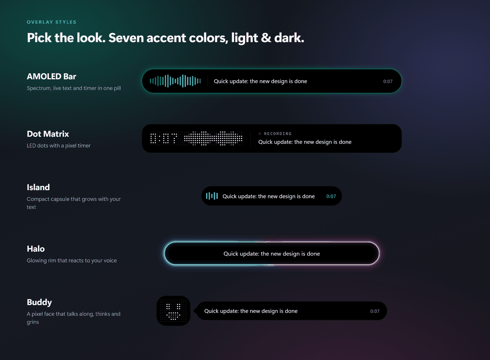

Five designs react to the actual sound of your voice: **AMOLED Bar**, **Dot Matrix**, **Island**, **Halo** and **Buddy**, a little LED face that talks along while you speak, thinks while NoType works and grins when your text is in. Each comes in seven accent colors, light and dark, with optional start and stop sounds. Place the overlay at the bottom, top or center of your screen. The settings show a live preview, so you can see it before you choose it.

### It learns your words

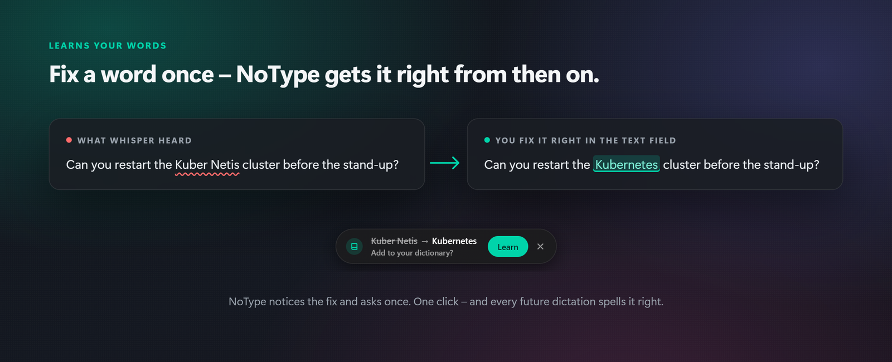

Names, brands and technical terms are where dictation usually fails. With NoType, you fix a wrong word once, right where you dictated it. NoType notices the correction and asks whether it should learn it. One click, and every future dictation spells it right.

You can also click a word in one of your recent dictations and type the correct spelling, or add terms to your dictionary directly. Corrections also catch spacing and hyphen variants ("Kuber Netis", "Kuber-Netis", "Kubernetis"), and they work with or without AI cleanup.

### Command mode: rewrite text with your voice

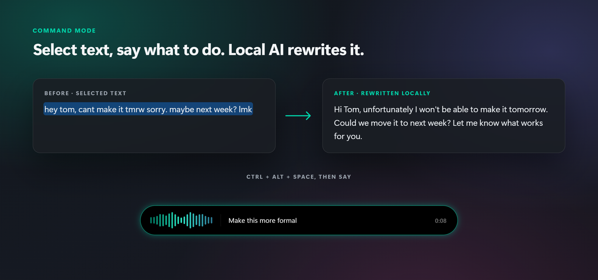

Select text in any app, hold <kbd>Ctrl</kbd> + <kbd>Alt</kbd> + <kbd>Space</kbd> and say what should happen to it:

- *"Make this more formal"*
- *"Translate this to English"*
- *"Turn this into bullet points"*

The local AI rewrites your selection in place. With nothing selected, it writes new text at your cursor, for example *"Write a short note declining tomorrow's meeting"*.

### AI cleanup that never slows you down

Raw speech is messy: "uhm", false starts, missing punctuation. NoType cleans it up in two steps:

| Mode | What happens | Extra wait |
|---|---|---|
| Off | The raw transcript is inserted as is | none |
| **Fast** (default) | Filler words and stutters are removed instantly, and sentences start with a capital letter | ~0 ms |
| AI | After the fast pass, a small local language model fixes grammar, punctuation and small recognition errors | usually 200–500 ms, with a hard time limit |

The AI engine ([Ollama](https://ollama.com/)) is installed **from inside NoType with one click**, without admin rights, into NoType's own folder. If the AI would take too long, or if it changes the meaning (for example by translating or answering your sentence), NoType inserts the fast version instead. You never wait on the AI.

### Everything in one place

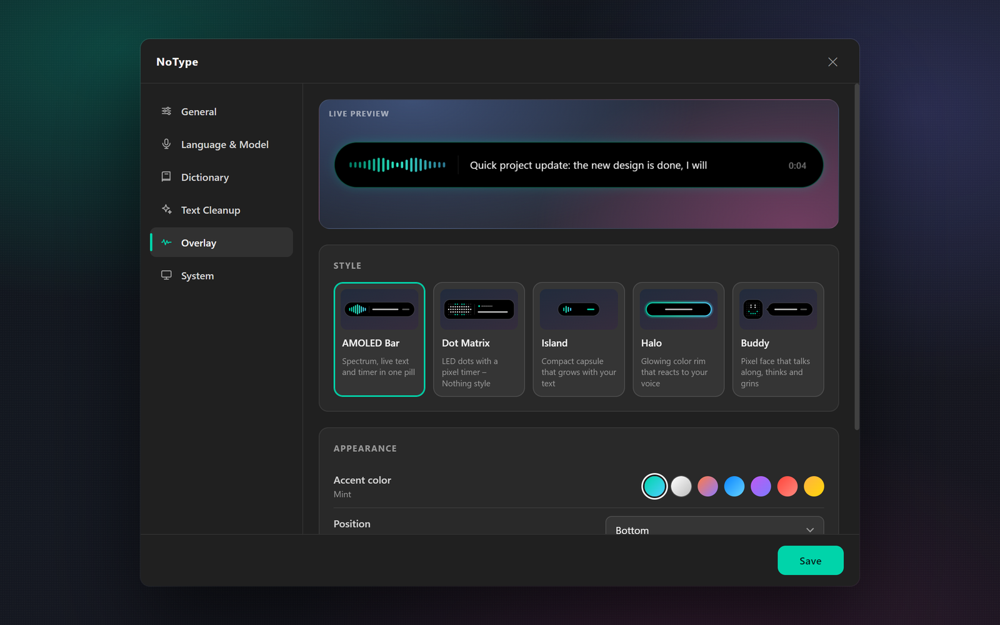

<table>
<tr>
<td width="50%">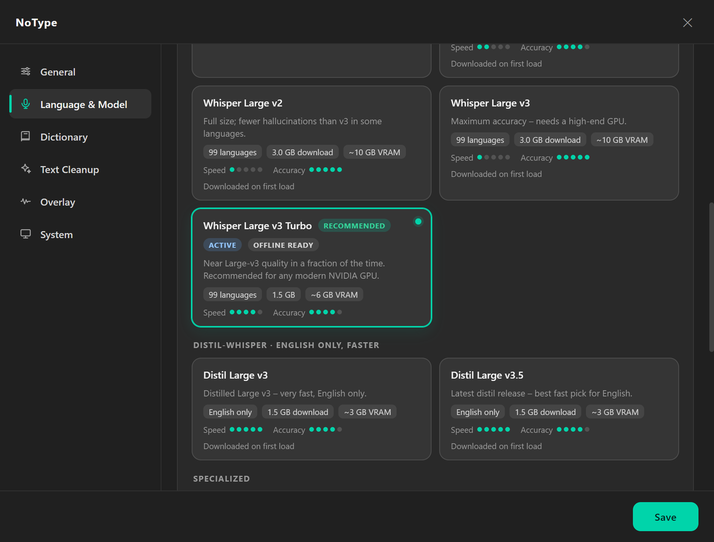</td>
<td width="50%">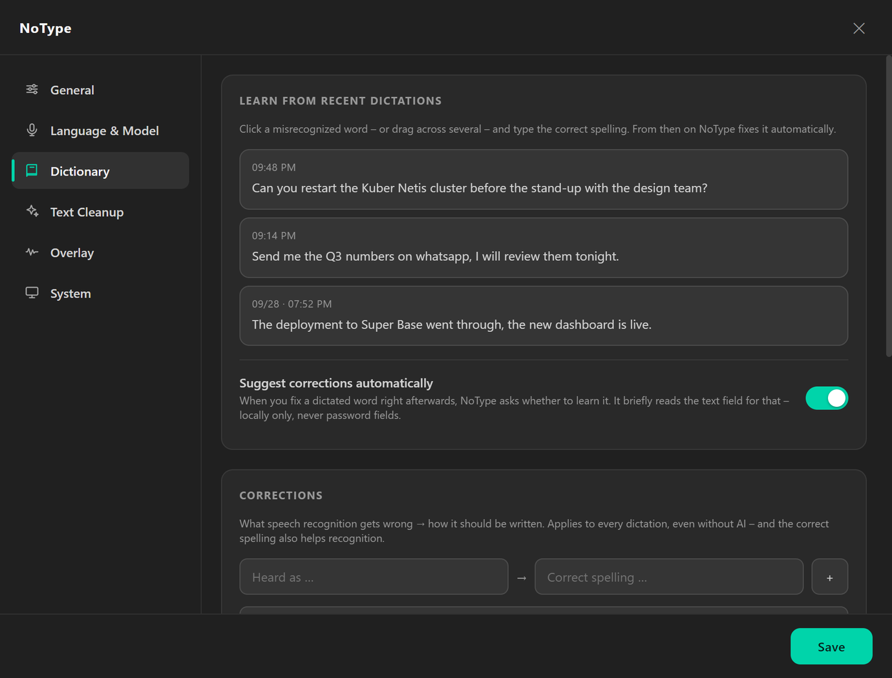</td>
</tr>
<tr>
<td><sub><b>Speech models:</b> ten free models as cards, with a recommendation for your graphics card</sub></td>
<td><sub><b>Dictionary:</b> learned corrections and words NoType should know</sub></td>
</tr>
<tr>
<td>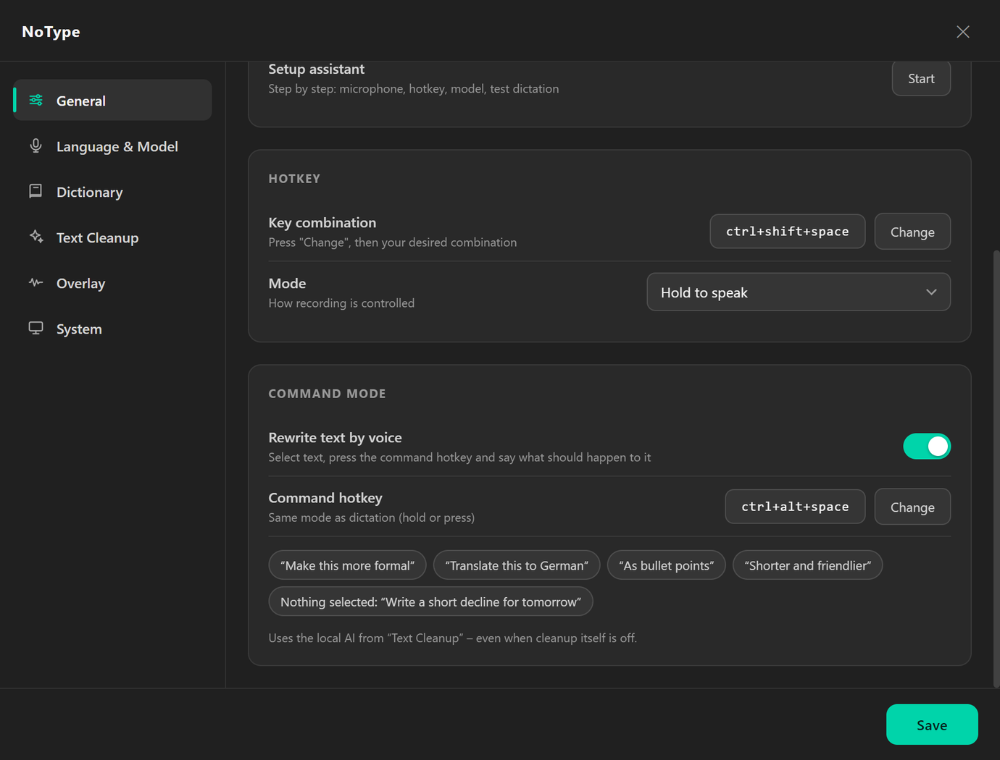</td>
<td>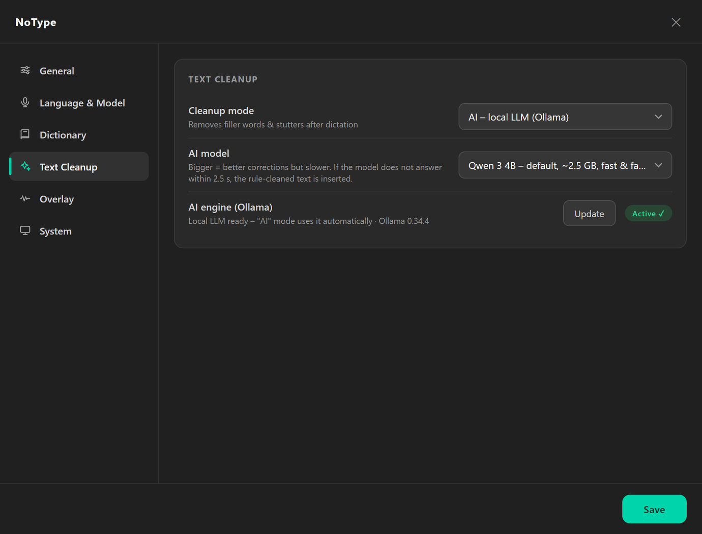</td>
</tr>
<tr>
<td><sub><b>Command mode:</b> its own shortcut, can be switched off</sub></td>
<td><sub><b>Text cleanup:</b> Off, Fast or AI, plus one-click AI engine install</sub></td>
</tr>
</table>

**And also:**

- **History and stats:** your last dictations and daily word counts are one click away in the system tray.
- **No invented words:** background noise does not turn into imaginary sentences. Repetitive and low-confidence output is dropped before it reaches your screen.
- **Works in stubborn apps:** if pasting is blocked (some terminals, remote desktops), NoType types the text key by key instead.
- **English or German interface:** switch any time under **Settings → General**.

<br/>

## Speech models

NoType ships a curated catalog of ten free, open speech models. Bigger models are more accurate, especially with mixed languages and technical terms. The setup guide recommends one for your hardware.

| Model | Languages | Memory | Best for |
|---|---|---|---|
| Whisper Tiny | 99 | ~1 GB | very old machines, quick notes |
| Whisper Base | 99 | ~1.5 GB | laptops without an NVIDIA card |
| Whisper Small | 99 | ~2 GB | laptops without an NVIDIA card, older cards |
| Whisper Medium | 99 | ~5 GB | mid-range graphics cards |
| Whisper Large v2 | 99 | ~10 GB | languages where v2 invents less than v3 |
| Whisper Large v3 | 99 | ~10 GB | maximum accuracy on high-end cards |
| **Whisper Large v3 Turbo** | 99 | ~6 GB | **any modern NVIDIA card (our recommendation)** |
| Distil-Whisper Large v3 | English | ~3 GB | fast English-only dictation |
| Distil-Whisper Large v3.5 | English | ~3 GB | the best fast English-only choice |
| Whisper Large v3 Turbo German | German | ~6 GB | pure German dictation (no English mixed in) |

<details>
<summary><b>Why no Parakeet, Canary, Nemotron or Voxtral?</b></summary>

<br/>

We benchmark alternative engines on real dictation before adding them. NVIDIA Parakeet TDT 0.6B (v3 and a German fine-tune, via ONNX Runtime) is genuinely fast: about 60 ms per sentence against about 450 ms for Whisper Large v3 Turbo on the same GPU. On German and mixed German/English dictation, though, it was at best as accurate as Whisper, and it can't take a custom vocabulary. With your dictionary terms, Whisper made about a fifth of the errors. Parakeet would also need a second CUDA runtime and about 4 GB more VRAM.

Canary 1B (v2 and Flash) was slower and less accurate in our tests and has the same vocabulary gap. CrisperWhisper's verbatim output doesn't fit clean dictation. Mistral's Voxtral has no practical local Windows runtime yet. We add engines as soon as they beat what we ship.

</details>

<br/>

## Your privacy

Dictation, AI cleanup and command mode are **fully offline**. There is no telemetry of any kind.

NoType goes online only for downloads you start yourself:

- the speech model you choose,
- the optional AI engine, and
- AI engine updates when you click **Update**.

Everything else stays in `%APPDATA%\NoType\` on your PC:

| Data | Where it lives |
|---|---|
| Settings | `settings.json` (with automatic backups) |
| Dictation history & stats | `history.json`, the last 10 entries |
| Diagnostic log | `notype.log`, rotating; timings and errors only, never your dictated text |
| AI engine & model | the `ollama\` subfolder |

**Uninstalling removes this whole folder** (updates keep it). The speech models are the exception: they live in the shared Hugging Face cache at `%USERPROFILE%\.cache\huggingface\hub\`, which other apps may use too, so the uninstaller leaves it alone. To free the space, delete the folders of the models you downloaded in NoType there; their names contain `whisper`, for example `models--mobiuslabsgmbh--faster-whisper-large-v3-turbo`. The portable version has no uninstaller: delete its folder and `%APPDATA%\NoType\` by hand.

NoType pastes through the clipboard, so the dictated text stays there afterwards and you can paste it again. If you use Windows clipboard history or sync across devices, it ends up there too. To keep the clipboard out of it, choose **Always type** under **Settings → System**.

To suggest corrections, NoType reads the text field you dictated into for up to a minute afterwards and compares only the dictated part. It stops as soon as you switch fields or start a new dictation. It never reads password fields and keeps nothing unless you click **Learn**. You can switch this off under **Settings → Dictionary**.

<br/>

## FAQ

<details>
<summary><b>Is it really free?</b></summary>

<br/>

Yes. No trial, no subscription, no account. If NoType saves you time, a ⭐ on GitHub is the best way to say thanks.

</details>

<details>
<summary><b>Can I use it at work?</b></summary>

<br/>

Yes. You can use NoType privately, at work, at school or anywhere else. You may not sell it; see [License](#license).

</details>

<details>
<summary><b>Does it work on macOS or Linux?</b></summary>

<br/>

Not at the moment. NoType is built for Windows 11.

</details>

<details>
<summary><b>Do I need an internet connection?</b></summary>

<br/>

Only once, to download the speech model (and the AI engine, if you want it). After that NoType works fully offline.

</details>

<details>
<summary><b>I don't have an NVIDIA graphics card. Will it work?</b></summary>

<br/>

Yes, NoType then runs on your processor. Pick **Small** or **Base** in the setup guide. Results take a little longer but are still very usable.

</details>

<br/>

## Troubleshooting

<details>
<summary><b>Nothing happens when I press the shortcut</b></summary>

<br/>

Wait until the model has finished loading; the tray icon's tooltip shows the status. Also check that no other app uses the same shortcut. Details are in `%APPDATA%\NoType\notype.log`.

</details>

<details>
<summary><b>Names or terms are spelled wrong</b></summary>

<br/>

Fix the word once where you dictated it, and click **Learn** when NoType asks. You can also add terms under **Settings → Dictionary**, or click a word in a recent dictation under **Learn from recent dictations** and type the correct spelling.

</details>

<details>
<summary><b>Command mode writes new text instead of changing my selection</b></summary>

<br/>

Command mode reads your selection by copying it. Some fields don't allow copying (password fields, some remote desktops), so NoType sees no selection and writes at the cursor instead. Like dictation, the result goes through the clipboard, which holds the new text afterwards.

Command mode needs the AI engine from **Settings → Text Cleanup**; AI cleanup itself can stay off. For better rewrites and translations, choose a larger model there (Qwen 3.5 9B) if your graphics card has the memory.

</details>

<details>
<summary><b>Transcription is slow</b></summary>

<br/>

Without an NVIDIA card, choose a smaller model (Small or Base). With one, use Large v3 Turbo.

</details>

<details>
<summary><b>Pasting doesn't work in my terminal</b></summary>

<br/>

Set **Settings → System → Insert method** to **Always type**. NoType then types the text key by key.

</details>

<details>
<summary><b>Graphics glitches while NoType is running</b></summary>

<br/>

Turn on **Settings → System → GPU safe mode** and restart the app. This moves the app's own drawing to the processor. A graphics driver update usually fixes the underlying problem.

</details>

<br/>

---

## For developers

NoType is a hybrid app. A **Python backend** handles audio capture, [faster-whisper](https://github.com/SYSTRAN/faster-whisper) inference, text insertion and the Ollama lifecycle. An **Electron frontend** handles the tray, overlay, settings and global hotkeys. The two talk newline-delimited JSON over stdin/stdout.

| Layer | Tech |
|---|---|
| Speech recognition | faster-whisper (CTranslate2), CUDA 12 with cuBLAS/cuDNN, automatic CPU fallback |
| AI cleanup & command mode | Ollama (portable, managed by the app) with Qwen 3 / Qwen 3.5 / Gemma 4 |
| Audio | sounddevice at 16 kHz, live spectrum bands for the overlay |
| Text insertion | Win32 `SendInput` + clipboard, Unicode typing fallback |
| Correction learning | Windows UI Automation (reads the dictated field only, never password fields) |
| Frontend | Electron 33, plain HTML/CSS/JS, no framework |
| Packaging | PyInstaller (backend) + electron-builder (NSIS installer) |

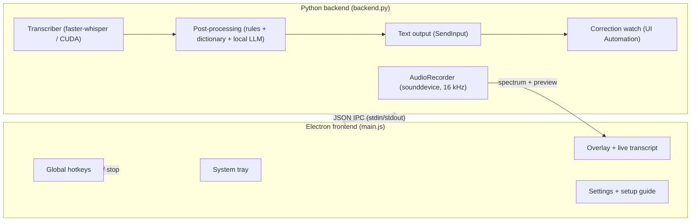

### Build from source

Prerequisites: Python 3.12, Node.js 18+, optionally an NVIDIA GPU with CUDA.

```bash
# Backend
python -m venv venv
venv\Scripts\activate
pip install -r requirements.txt
pyinstaller --noconfirm backend.spec        # → dist/backend/

# Frontend
cd electron
npm install
npm start                                    # dev mode
npm run build                                # → dist/NoType-Setup-<version>.exe
npm run build:dir                            # → dist/win-unpacked/ (portable)
```

### Project structure

```
NoType/
├── backend.py            # IPC loop, recording, transcription orchestration
├── audio_recorder.py     # sounddevice capture, spectrum bands, rolling preview window
├── transcriber.py        # faster-whisper wrapper, model cache, cuBLAS fallback
├── postprocess.py        # rule cleanup + local LLM polish and command mode via Ollama
├── dictionary.py         # learned corrections ("heard → meant"), applied to every dictation
├── correction_watch.py   # spots fixes typed right after a dictation (UI Automation)
├── ollama_manager.py     # portable Ollama install, update, lifecycle (job object), model pull
├── text_output.py        # clipboard + SendInput paste/copy, Unicode typing fallback
├── config.py             # atomic settings with rolling backups (%APPDATA%/NoType)
├── backend.spec          # PyInstaller build
├── docs/assets/          # screenshots and demo used in this README
└── electron/
    ├── main.js           # tray, overlay, hotkeys, IPC, lifecycle, GPU safety
    ├── preload.js        # contextBridge IPC surface
    ├── model-catalog.js  # the ten speech models and their metadata
    ├── overlay.html      # 5 spectrum-reactive overlay styles + live transcript
    ├── settings.html     # settings window
    ├── onboarding.html   # first-run setup guide
    ├── suggest.html      # "learn this correction?" prompt
    ├── toast.html        # notification toast
    └── package.json      # electron-builder (NSIS installer)
```

### Reliability engineering

- Serialized inference (the CUDA model is not thread-safe); live preview and final pass share one lock.
- Startup inference self-test; a cuBLAS compute-type rejection triggers an automatic, persisted float16 fallback.
- Backend circuit breaker with exponential backoff and a give-up threshold; IPC ping/pong watchdog.
- Ollama is bound to the backend via a kill-on-close Job Object, so force-killing the app cannot orphan it.
- Atomic settings writes with three rolling backups; overlay rendering avoids compositor constructs that provoke GPU driver timeouts.

### Contributing

Bug reports and ideas are welcome. Please [open an issue](https://github.com/MJM-DEVS/NoType/issues) and include `%APPDATA%\NoType\notype.log` if something breaks (it contains no dictated text). Pull requests are welcome too; by submitting one, you agree that your contribution is licensed under the same terms as the project.

<br/>

## License

NoType is **source-available** under the [MIT License with the Commons Clause](LICENSE).

**In plain words:**

- ✅ Free for everyone to use: at home, at work, at school.
- ✅ Read, modify and share the code; fork it and build on it.
- ❌ You may not **sell** NoType, or a product or service whose value comes mainly from NoType. That includes paid hosting and paid support for it.

Because of the Commons Clause, this is not an OSI-approved open-source license.

<br/>

## Acknowledgements

NoType stands on the shoulders of great open projects: [OpenAI Whisper](https://github.com/openai/whisper), [faster-whisper](https://github.com/SYSTRAN/faster-whisper) and [CTranslate2](https://github.com/OpenNMT/CTranslate2), [Distil-Whisper](https://github.com/huggingface/distil-whisper), [Ollama](https://github.com/ollama/ollama), the [Qwen](https://github.com/QwenLM) and [Gemma](https://ai.google.dev/gemma) model families, and [Electron](https://www.electronjs.org/). Models are downloaded from their original publishers and are subject to their own licenses.

<div align="center">
<br/>

**If NoType saves you some typing, please give it a ⭐. It helps other people find it.**

<sub>Built for people who think faster than they type · Made by Mijo Jurisic · <a href="https://mjmads.com">mjmads.com</a></sub>

</div>
