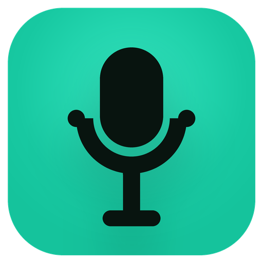
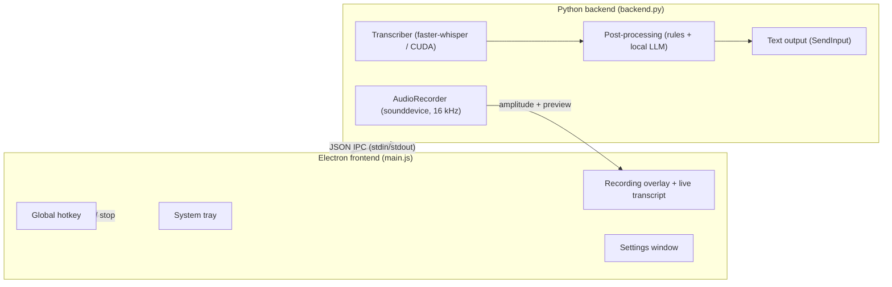

<div align="center">



# NoType

### Speak instead of typing — private, instant, on your own PC

**Hold a key. Say what you're thinking. Release. Your words appear wherever your cursor is.**

NoType is voice dictation for Windows 11 that runs entirely on your own machine. No cloud, no subscription, no account — and nothing you say ever leaves your computer.

<br/>


</div>

---

## Why NoType

Most people speak three times faster than they type. NoType turns that speed into text — in your email, your chat, your documents, your code editor, any app with a text field.

What makes it different from cloud dictation tools:

- **Completely private.** The speech recognition and the AI text cleanup run on your own GPU. There is no server, no telemetry and no account. Your voice never leaves your machine.
- **No subscription.** Install it once, use it forever. The models are free and downloaded once.
- **Works everywhere.** If you can place a cursor in it, you can dictate into it.
- **Fast.** On a modern NVIDIA GPU a typical dictation appears in well under a second after you stop speaking.

---

## What you get

**Push-to-talk dictation.** Hold your hotkey while speaking, or tap once to start and once to stop — your choice. A subtle animated overlay shows that NoType is listening and reacts to your voice.

**Live transcript.** Watch your words appear above the overlay while you are still speaking, so you always know you have been understood.

**AI text cleanup.** Raw speech is messy — "ähm", false starts, missing punctuation. NoType cleans your transcript in two stages: an instant rule-based pass removes filler words and stutters, and an optional local AI model polishes grammar and punctuation. The AI runs on your machine too (installed with one click from the settings, powered by Ollama) and is bound to a strict time budget: if it would slow you down, NoType inserts the fast version instead.

**Your vocabulary.** Product names, brand names, colleagues, technical terms — add up to 850 characters of custom vocabulary and NoType spells them correctly.

**Mixed languages.** Dictate in German with English technical terms sprinkled in (or the other way around) — the large models handle code-switching remarkably well.

**99 languages.** Every language the Whisper models support is available, from Arabic to Vietnamese, with automatic language detection if you want it.

**History and stats.** Your last dictations and daily word counts live in the system tray, one click away.

**No noise, no nonsense.** Background noise does not turn into imaginary words — repetitive and low-confidence output is dropped before it ever reaches your screen. Insertion works even in terminals and paste-resistant apps thanks to an automatic typing fallback.

---

## How it works

1. **Press and hold your hotkey** (default: Ctrl + Shift + Space). The overlay appears and NoType listens.
2. **Speak naturally.** The live transcript shows what is being recognized while you talk.
3. **Release.** Your words are transcribed at full quality, cleaned up, and inserted at your cursor — usually in under a second.

The first launch downloads your chosen speech model once; after that everything works offline.

---

## Supported models

NoType ships a curated catalog of ten open-weight speech models. Pick the one that fits your hardware and language — bigger models are more accurate, especially for mixed-language speech and technical vocabulary.

| Model | Languages | VRAM/RAM | Best for |
|---|---|---|---|
| Whisper Tiny | 99 | ~1 GB | very old machines, quick notes |
| Whisper Base | 99 | ~1.5 GB | CPU-only laptops |
| Whisper Small | 99 | ~2 GB | CPU-only machines, older GPUs |
| Whisper Medium | 99 | ~5 GB | mid-range GPUs |
| Whisper Large v2 | 99 | ~10 GB | languages where v2 hallucinates less than v3 |
| Whisper Large v3 | 99 | ~10 GB | maximum accuracy on high-end GPUs |
| **Whisper Large v3 Turbo** | 99 | ~6 GB | **any modern NVIDIA GPU — our recommendation** |
| Distil-Whisper Large v3 | English | ~3 GB | fast English-only dictation |
| Distil-Whisper Large v3.5 | English | ~3 GB | the best fast English-only choice |
| Whisper Large v3 Turbo German | German | ~6 GB | dictation in pure German (no mixed-in English) |

All models run locally through one engine, [faster-whisper](https://github.com/SYSTRAN/faster-whisper), with GPU acceleration and automatic CPU fallback. Quantization is handled automatically — if your GPU rejects a mode, NoType silently falls back to one that works. Single-language models lock their language automatically.

**Why no Parakeet, Canary, Nemotron or Voxtral?** We benchmark alternative engines on real dictation workloads before adding them. In our current tests, NVIDIA Parakeet TDT 0.6B v3 and Canary 1B (v2 and Flash) were slower on consumer Windows GPUs and less accurate on German and mixed German/English speech than Whisper Large v3 Turbo — and none of them support custom vocabulary, which matters most for everyday dictation. CrisperWhisper's verbatim output format is incompatible with clean dictation. Mistral's Voxtral currently has no practical local Windows runtime. We add engines the moment they beat what we ship — not just to have a longer list.

---

## The AI cleanup, explained

| Mode | What happens | Extra latency |
|---|---|---|
| Off | The raw transcript is inserted as-is | none |
| Fast (default) | Filler words ("ähm", "uh") and stutter repetitions are removed instantly, sentence start re-capitalized | ~0 ms |
| AI | Fast pass, then a local language model fixes grammar, punctuation and small recognition errors | typically 200–500 ms, hard-capped |

The AI mode uses a small language model running in [Ollama](https://ollama.com/) — installed **from inside NoType with one click**, no admin rights, into NoType's own data folder. Short dictations skip the AI pass automatically, and if the model ever takes too long, the fast version is inserted instead. You never wait on the AI.

---

## Installation

**Requirements:** Windows 11 (x64). An NVIDIA GPU is recommended for instant transcription; without one, NoType falls back to CPU (choose a smaller model there).

1. Download and run `NoType-Setup-<version>.exe`. No admin rights required.
2. Launch NoType — it lives in your system tray. The first run downloads your speech model.
3. Place your cursor in any text field, hold **Ctrl + Shift + Space**, and speak.
4. Optional: open Settings (tray icon) and click **Install** next to "KI-Engine (Ollama)" to enable AI cleanup.

---

## Settings at a glance

| Setting | What it does |
|---|---|
| Hotkey & mode | Any key combination; hold-to-speak or press-to-toggle |
| Language | One of 99 languages, or automatic detection per recording |
| Model | Ten open-weight models — see [Supported models](#supported-models) |
| Custom vocabulary | Names and terms NoType should spell correctly (up to 850 characters) |
| Text cleanup | Off / Fast / AI — see [The AI cleanup](#the-ai-cleanup-explained) |
| Live transcript | Show recognized text in the overlay while recording |
| Insert method | Automatic (paste with typing fallback) or always type — for terminals |
| Overlay style | Ten voice-reactive visualizers — including an AMOLED family (pure-black bar top/bottom or centered card, brand-color synth, transcript inside) |
| Microphone | System default or a specific device, with a built-in level test |
| Success popup | Optional confirmation toast; errors always show |

---

## Your data and privacy

Everything stays in `%APPDATA%\NoType\` on your machine:

| Data | Where it lives |
|---|---|
| Settings | `settings.json` (with automatic backups) |
| Dictation history & stats | `history.json` — last 10 entries, local only |
| Diagnostic log | `notype.log`, rotating, local only |
| AI cleanup runtime & model | `%APPDATA%\NoType\ollama\` — removed with the app |

Network access happens exactly twice, and only for downloads: the speech model on first use, and the optional AI cleanup runtime if you enable it. Dictation itself — including the AI cleanup — is fully offline. There is no telemetry of any kind.

---

## Troubleshooting

<details>
<summary><b>Nothing happens when I press the hotkey</b></summary>

<br/>

Wait for the model to finish loading (the tray tooltip shows the status), and check that no other app uses the same shortcut. Details are in `%APPDATA%\NoType\notype.log`.

</details>

<details>
<summary><b>Specific names are spelled wrong</b></summary>

<br/>

Add them to **Settings → Eigene Begriffe** — e.g. `Anthropic, MetricDash, Supabase`. The model treats these as known vocabulary.

</details>

<details>
<summary><b>Transcription is slow on my machine</b></summary>

<br/>

Without an NVIDIA GPU, pick a smaller model (Small or Base). With one, use Large v3 Turbo and keep beam size on Auto.

</details>

<details>
<summary><b>Pasting doesn't work in my terminal</b></summary>

<br/>

Set **Settings → Einfügemethode** to "Immer tippen". NoType then types the text directly instead of pasting.

</details>

<details>
<summary><b>Graphics glitches while NoType is active</b></summary>

<br/>

Enable **Settings → GPU-Sicherheitsmodus** and restart the app. This moves all rendering to the CPU — the escape hatch for flaky graphics drivers. A driver update usually fixes the root cause.

</details>

---

## For developers

<details>
<summary><b>Architecture, building from source, project structure</b></summary>

<br/>

NoType is a hybrid app: a **Python backend** (audio capture, faster-whisper inference, text insertion, Ollama lifecycle) and an **Electron frontend** (tray, overlay, settings, global hotkey), talking over newline-delimited JSON on stdin/stdout.



### Build from source

Prerequisites: Python 3.12, Node.js 18+, optionally an NVIDIA GPU with CUDA.

```bash
# Backend
python -m venv venv
venv\Scripts\activate
pip install -r requirements.txt
pyinstaller --noconfirm backend.spec        # → dist/backend/

# Frontend
cd electron
npm install
npm start                                    # dev mode
npm run build                                # → dist/NoType-Setup-<version>.exe
```

### Project structure

```
No Type/
├── backend.py            # IPC loop, recording, transcription orchestration
├── audio_recorder.py     # sounddevice capture, amplitude, rolling preview window
├── transcriber.py        # faster-whisper wrapper, model cache, cuBLAS fallback
├── postprocess.py        # rule cleanup + local LLM polish via Ollama
├── ollama_manager.py     # portable Ollama install, lifecycle (job object), model pull
├── text_output.py        # clipboard + SendInput paste, Unicode typing fallback
├── config.py             # atomic settings with rolling backups (%APPDATA%/NoType)
├── backend.spec          # PyInstaller build
└── electron/
    ├── main.js           # tray, overlay, hotkey, IPC, lifecycle, GPU safety
    ├── preload.js        # contextBridge IPC surface
    ├── overlay.html      # 7 voice-reactive visualizers + live transcript caption
    ├── settings.html     # settings window
    ├── toast.html        # notification toast
    └── package.json      # electron-builder (NSIS installer)
```

### Reliability engineering

- Serialized inference (the CUDA model is not thread-safe); live preview and final pass share one lock.
- Startup inference self-test; cuBLAS compute-type rejection triggers an automatic, persisted float16 fallback.
- Backend circuit breaker with exponential backoff and give-up threshold; IPC ping/pong watchdog.
- Ollama bound to the backend via a kill-on-close Job Object — force-killing the app cannot orphan it.
- Atomic settings writes with three rolling backups; overlay rendering avoids TDR-provoking compositor constructs.

</details>

---

## License

NoType is source-available under the **Functional Source License (FSL-1.1-MIT)** — see [`LICENSE`](LICENSE).

In plain words: use it freely (personally, at work, for education and research), read and modify the code, share your changes. What is not allowed: offering NoType, or a derivative of it, as a competing commercial product or service. Every release automatically converts to the plain MIT license two years after publication.

<div align="center">
<br/>
<sub>Built for people who think faster than they type.</sub>
</div>
